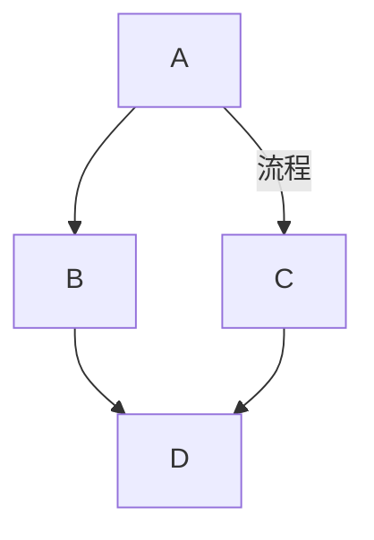
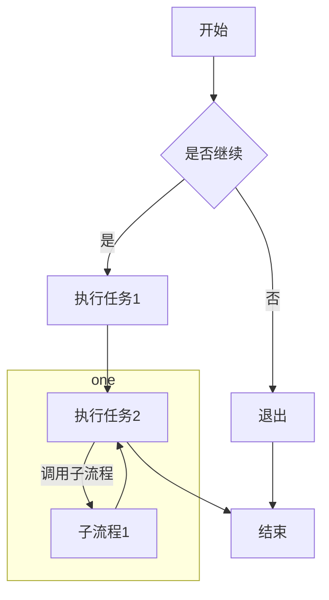
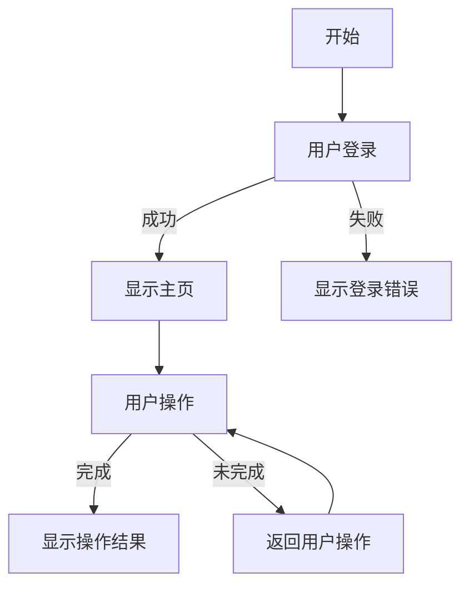
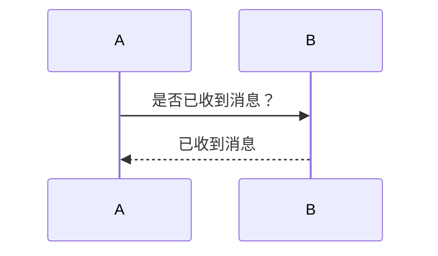
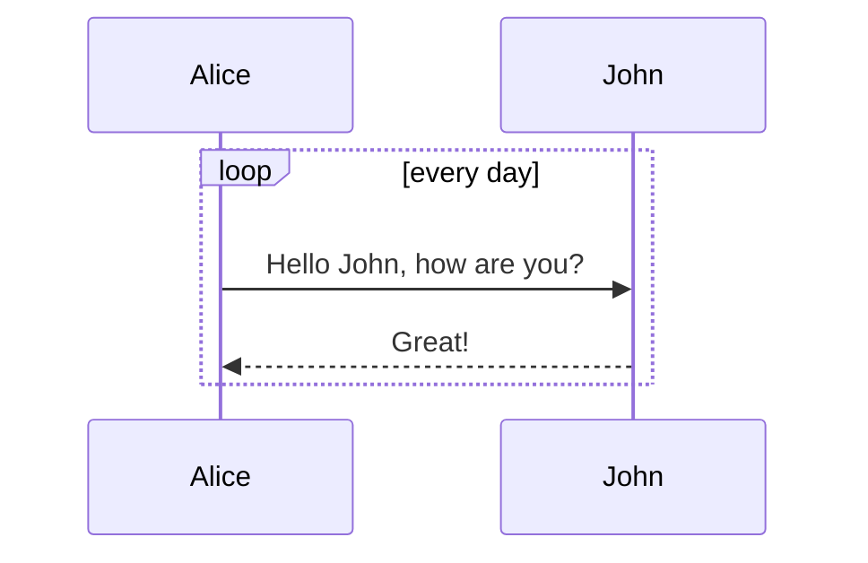
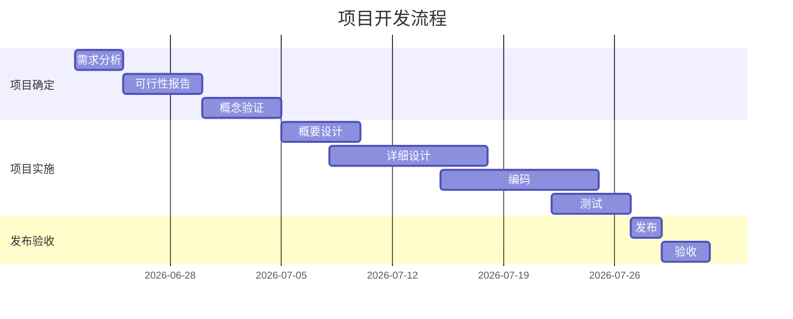
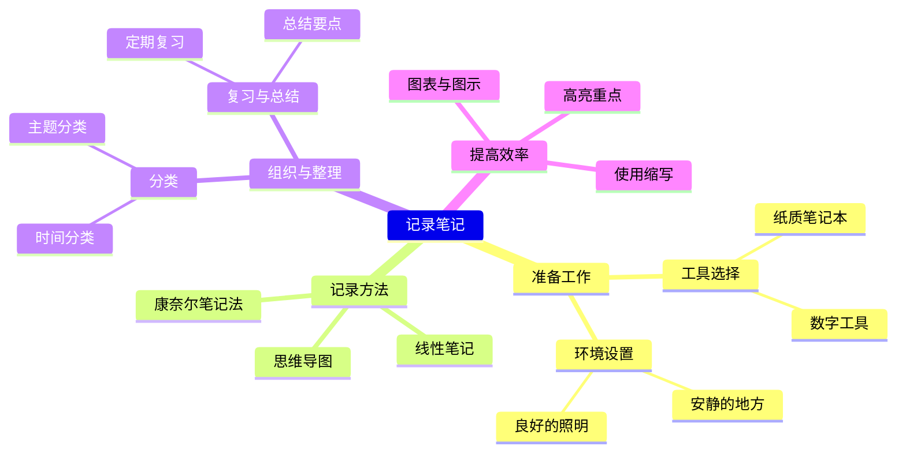
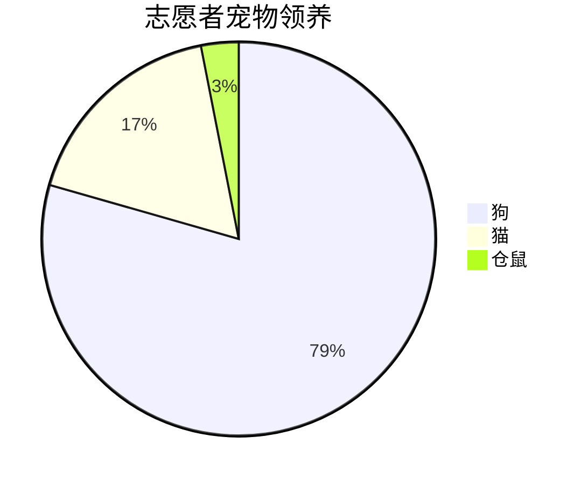

# Markdown 从入门到精通

## 前言：

Markdown 本身是免费的，并可以通过 BSD 风格的开源许可证获得。格鲁伯的这一开源精神极大地推动了 Markdown 在不同平台上的实现和发展。

现如今大部分网站都支持markdown语法，程序员必备技能快一起来学习吧！

## 一、markdown使用场景

> TIP
>
> Markdown 可以用于任何事情，通过简单的标记语法，它可以使普通文本内容具有一定的格式
>
> > 对于程序开发人员：
>
> - **技术文档编写：** 编写 技术文档、API 文档、用户手册、安装指南等；
> - **代码注释 和 README 文件：** 在代码库中，开发人员会使用 Markdown 来编写 README 文件，介绍项目的目的、使用方法、依赖关系等。此外，Markdown 也常用于代码注释中，以提供额外的说明和解释。
> - **在线协作 和 代码托管平台**：在 GitHub、GitLab 等代码托管平台上，开发人员使用 Markdown 来编写 issue、pull request 的描述，以及项目页面的内容。Markdown 使得这些文本易于阅读和理解，促进了团队成员之间的有效沟通。
> - **写作与笔记**：用于撰写博客文章、日记、笔记等。许多博客平台和笔记软件都支持 Markdown 语法。
> - **学术写作**：Markdown 也适用于撰写论文、研究报告等学术文档。通过 Markdown，作者可以方便地组织文档结构、插入公式 和 图表，以及引用参考文献。（LaTeX 公式支持）
> - 用它创建网站、文档、书籍、演示、电子邮件、撰写电子书（Gitbook）等
>
> > 当前许多网站都广泛使用 Markdown 来撰写帮助文档 或 是用于论坛上发表消息。例如：GitHub、Gitee、GitLab、掘金、知乎、简书 等。

## 二、Markdown 的基本语法

### 1、分级标题

1. 一个警号符(#)加一个空格键 + 文本内容 可显示为一级大标题
2. 两个警号符(#)加一个空格键 + 文本内容 可显示为二级大标题
3. 三个警号符(#)加一个空格键 + 文本内容 可显示为三级大标题
4. 以此类推…

```
# 一级标题

## 二级标题

### 三级标题

#### 四级标题

##### 五级标题

###### 六级标题

```

### 2、换行 

Markdown 中，段落之间的换行是通过在段落之间留空行的方式来实现。

但我们会有其他的换行需求，可以这样实现：

* 键入 HTML 语言换行标签：`<br>`（通用）
* 段落内换行使用换行符 `<br>`，或者 `两个空格` + `shift-Enter`。不推荐使用 `\` + `shift-Enter`。
* Typora 中，空行中使用四个空格（一个 Tab）可以快速增大段落之间的间距

为了演示效果，举例如下：

```markdown
春望<br>唐代：杜甫

国破山河在，城春草木深。
感时花溅泪，恨别鸟惊心。
烽火连三月，家书抵万金。
白头搔更短，浑欲不胜簪。
```

### 2、段首缩进 

使用 Markdown 写文章不需要段首缩进。但如果你需要的话，可以在段落前面使用：

#### 1）两个全角空格 

因为一个全角空格（space）的宽度是整整一个汉字，输入两个全角空格正好是两个汉字的宽度。

全角空格的输入方法为：一般的中文输入法都是按 shift + space，可以切换到全角模式下，输完后再次按 shift + space 切换回正常输入状态。

#### 2）使用特殊占位符 

使用特殊占位符，不同占位符所占空白是不一样大的。

```markdown
&ensp; or &#8194;  表示一个半角的空格
&emsp; or &#8195;  表示一个全角的空格
&emsp;&emsp;       两个全角的空格（用的比较多）
&nbsp; or &#160;   不断行的空白格
```

  表示一个半角的空格
  表示一个全角的空格
   两个全角的空格（用的比较多）
 不断行的空白格

### 3、折叠内容

HTML `<details>` 标签指定了用户可以根据需要打开和关闭的额外细节。

语法：

```
<details> <summary>Title</summary>
contents ...
</details>
```

<details> <summary>Title</summary>
contents ...
</details>

内容里面可以嵌套使用 Markdown 语法和 HTML 语法。

有的 Markdown 中，可能 `<summary>` 标签与正文间要空一行。比如：

```
<details> <summary>View Code</summary>

code ...

</details>
```

### 4、字体

##### 4.1、强调（加粗

两个星号(*) + 文本内容 可显示为文本内容加粗

```
『**文字**』 加粗字体
```

##### 4.2、斜体

一个星号(*) + 文本内容 可显示为文本内容倾斜*

```
『*文字*』 文本内容倾斜
```

*文字*

##### 4.3、删除线

用一对双飘号 `~~` 包裹内容，或者使用快捷键 Shift+Alt+5

两个波浪线(~) + 文本内容 可显示为划去文本内容

```markdown
『~~文字~~』 划去文本内容
```

~~文字~~

> 三个星号(*) + 文本内容 可显示为文本加粗倾斜
>
>

```markdown
>**_加粗斜体_**
>***加粗斜体***
>```

>
>

##### 4.4、下划线

用一对 u 标签 `<u>` 包裹内容，或者使用快捷键 Ctrl+U（注意，部分 Markdown 编辑器可能不支持）

```
<u>下划线</u>
```

<u>下划线</u>

##### 4.5、文字高亮

用一对双等号 `==` 包裹内容（注意，部分 Markdown 编辑器可能不支持）

```
==将文字高亮==
```

==包裹==

==高量==

##### 4.6、字体、字号、颜色

Markdown 是一种可以使用普通文本编辑器编写的标记语言，通过类似 HTML 的标记语法，它可以使普通文本内容具有一定的格式。但是它本身是不支持修改字体、字号 与 颜色等功能。

```markdown
<font face="字体名称">我是文本内容，设置字体</font><br>
<font color="red">我是文本内容，字体颜色</font><br>
<font size="5">我是文本内容，文字大小</font>
```

<font face="字体名称">我是文本内容，设置字体</font><br>
<font color="red">我是文本内容，字体颜色</font><br>
<font size="5">我是文本内容，文字大小</font>

```
<font face="黑体"> 我是黑体字 </font>
<font face="微软雅黑"> 我是微软雅黑 </font>

<font color=gray size=7> color=gray </font>
<font color=#00ffff size=7> color=#00ffff </font>
<font color=#0099ff size=7 face="黑体"> color=#0099ff size=7 face="黑体" </font>

// Size：规定文本的尺寸大小。可能的值：从 1 到 7 的数字。浏览器默认值是 3。
```

##### 4.7、文字居中 

对于标准的 Markdown 文本，默认左对齐，是不支持居中对齐的。我们采用 HTML 语法格式：

```
<center>文字居中</center>
```

文字居中

```html
<font face="逐浪新宋">我是逐浪新宋</font>
<font face="逐浪圆体">我是逐浪圆体</font>
<font face="逐浪花体">我是逐浪花体</font>
<font face="逐浪像素字">我是逐浪像素字</font>
<font face="逐浪立楷">我是逐浪立楷</font>
<font color=red>我是红色</font>
<font color=#008000>我是绿色</font>
<font color=yellow>我是黄色</font>
<font color=Blue>我是蓝色</font>
<font color=#871F78>我是紫色</font>
<font color=#DCDCDC>我是浅灰色</font>
<font size=5>我是尺寸</font>
<font size=10>我是尺寸</font>
<font face="逐浪立楷" color=green size=10>我是逐浪立楷，绿色，尺寸为5</font>
```

##### 4.8、添加背景色

Markdown 本身不支持背景色设置，需要借助 table、tr、td 等表格标签的 bgcolor 属性来实现背景色的功能。举例如下：

```
<table><tr><td bgcolor=#FF4500>
    这里的背景色是：OrangeRed，十六进制颜色值：#FF4500，rgb(255, 69, 0)
</td></tr></table>
```

呈现效果如下：

<table><tr><td bgcolor=#FF4500>

    这里的背景色是：OrangeRed，十六进制颜色值：#FF4500，rgb(255, 69, 0)

</td></tr></table>

### 6、外链接（超链接）

要创建链接，请将链接文本括在括号中

在一对方括号内[填充内容]后加上一对(填充网址)

```
 [点击跳转](http://www.hahha.com) 得到
```

 [点击跳转](http://www.hahha.com) 得到

### 7、图片

感叹号(!) + [图片名字] + 再打入一对括号可自动有选择图片的按钮(注意：此处符号为英文字符)

插入图像的语法： 

```


```

> 注：图像链接地址，相对路径 和 绝对路径（网络地址）都支持

或者 使用 HTML 标签插入图片

```


```

### 8、链接图像

要添加到图像的链接，请将图像的 MarkDown 括在括号中，然后将链接添加到括号中。

```
[](https://arryblog.com)
[](https://XXXXXX.com)
```

### 9、引用

##### 9.1、带有多个段落的引用块

要创建引用块，请在段落前添加一个 `>`

一个英文尖括号(>) 后加一个空格键+ 文本内容 即可显示文本引用

例如

> 一个小小的改变，可能带来生活质量的大提升。

> 黑夜无论怎样悠长，白昼总会到来。 --莎士比亚 《麦克白》

```
『> 空格』 引用
```

##### 9.2、嵌套引用块

例如

> > 这是一段带小箭头前缀的引用文本。

##### 9.3、带有其他元素的引用块

引用块可以包含其他 Markdown 格式的元素，并非所有元素都可以使用，需要尝试看看哪些元素有效。

```markdown
> #### Markdown 语法的学习
>
> - 什么是 Markdown ？
> - 为什么要用 Markdown ?
> - 支持 Markdown 的应用程序和组件，工具
> - Markdown 文件的工作原理
> - Markdown 的基本语法
>
> **真的真的** 是太好用了，我今天就开始**用起来 ！**
```

> #### Markdown 语法的学习
>
> - 什么是 Markdown ？
> - 为什么要用 Markdown ?
> - 支持 Markdown 的应用程序和组件，工具
> - Markdown 文件的工作原理
> - Markdown 的基本语法
>
> **真的真的** 是太好用了，我今天就开始**用起来 ！**

### 10、列表 - 有序列表

* 在每一行的前面加上一个数字和一个点号（`.`），然后跟一个空格

 输入一个数字加（.） 再加上回车 ，下一次回车可自动延续，如果下一次不想要序号了，连续按两次回车

```
『1. 空格』有序列表
```

> 列表中的每个项目都应以递增的数字开始（尽管 Markdown 引擎会自动处理数字顺序，你仍然可以按任意顺序输入它们）

1. 第一项
2. 第二项
   1. 缩进的项
   2. 缩进的项

3. 第三项

### 11、列表 - 无序列表

* 要创建无序列表，请在行项目前添加破折号 `-` 星号 `*` 或 加号 `+`
* 缩进一项或多项以创建嵌套列表

（-） 加空格 或者 （*） 加空格 都可生成黑色小圆点

```
『- 空格』 无需列表
```

* 第一项
* 第二项
  + 缩进项
  + 缩进项
    - 缩进的缩进项
    - 缩进的缩进项

* 第三项

### 12、分割线

要创建水平线，请在一行上单独使用三个 或 更多星号 `***` 、破折号 `---` 或 下划线 `___`

三个减号(-) 加上回车

---

```
--- 分割线
```

三个星号(*)加上回车

***

```
*** 分割线
```

### 

|      |      |      |
| ---- | ---- | ---- |
|      |      |      |

### 13、代码块

在 Markdown 中插入代码块有两种方式：行内式和块级式。

### 13.1、单行代码块

使用单个反引号 ` 将代码包裹起来

例如：

```markdown
`这是一个行内式代码块`
```

 `hello world`

### 13.2、块级代码块（多行）

可支持多种编程语言类型：html、css、javascript、vue、java、python ...

三个上点号（`） 加代码 再以三个上点号 结尾就可以形成代码块

~~~markdown
```编程语言类型
代码片段
代码片段

```
~~~

例如：

『```代码语言 空格』  代码块

```js
console.log("Hello, world!");
```

## 三、MarkDown 进阶语法

TIP

深入浅出 转义字符，表格，脚注，上标、下标、Task Lists 任务列表（待办事宜 Todo 列表），锚点 和 内容目录

### 1、转义字符（显示特殊符号）

如何在 MarkDown 文档中 打出特殊字符，要显示原本用于在 Markdown 文档中格式化文本的文字字符，在字符前面添加反斜杠 `\

### 2、表格

1. 如果下载了Typora软件，可直接右键插入一个表格
2. 还可以         | 姓名 | 年龄 | 年龄 |        再按下回车可自动生成表头

例如：

| 姓名 | 年龄 | 年龄 |
| ---- | ---- | ---- |
|      |      |      |

##### 2.1、基础表格

```markdown
| 表头列 1 | 表头列 2 | 表头列 3 |
| -------- | -------- | -------- |
| 数据 1   | 数据 2   | 数据 3   |
| 数据 4   | 数据 5   | 数据 6   |
```

##### 2.2、带对齐方式的表格

```markdown
| 左对齐 | 居中对齐 | 右对齐 |
| :----- | :------: | -----: |
| 数据 1 |  数据 2  | 数据 3 |
| 数据 4 |  数据 5  | 数据 6 |
```

> 原生方法

```text
name | 111 | 222 | 333 | 444
:-: | :-: | :-: | :-: | :-:
aaa | bbb | ccc | ddd | eee| 
fff | ggg| hhh | iii | 000|
```

##### 2.3、复杂表格（需要合并单元格）

MarkDown 本身并不直接支持合并单元格的功能，但可以通过兼容 HTML 的方式来实现。以下是一个包含合并单元格的表格示例

```markdown
<table border="1" width="800">
    <thead>
        <tr>
            <th colspan="2">需求：V0.3版本规划</th>
            <th>优先级</th>
            <th>任务分解</th>
            <th>产品负责人</th>
        </tr>
    </thead>
    <tbody>
        <tr>
            <td rowspan="3">功能模块1</td>
            <td>具体事项1</td>
            <td>3</td>
            <td>任务1</td>
            <td rowspan="3">@翠花</td>
        </tr>
        <tr>
            <td rowspan="2">具体事项2</td>
            <td>4</td>
            <td>任务2</td>
        </tr>
        <tr>
            <td>1</td>
            <td>任务3</td>
        </tr>
        <tr>
            <td rowspan="6">功能模块2</td>
            <td>具体事项1</td>
            <td>2</td>
            <td>任务1</td>
            <td rowspan="6">@美美</td>
        </tr>
        <tr>
            <td rowspan="4">具体事项2</td>
            <td>3</td>
            <td>任务1</td>
        </tr>
        <tr>
            <td>2</td>
            <td>任务2</td>
        </tr>
        <tr>
            <td>1</td>
            <td>任务3</td>
        </tr>
        <tr>
            <td>4</td>
            <td>任务4</td>
        </tr>
        <tr>
            <td>具体事项3</td>
            <td>1</td>
            <td>任务1</td>
        </tr>
    </tbody>
    <tfoot>
        <tr>
            <th colspan="5">备注信息</th>
        </tr>
        <tr>
            <td colspan="5">...</td>
        </tr>
    </tfoot>
</table>
```

渲染效果：

<table border="1" width="800">

    <thead>
        <tr>
            <th colspan="2">需求：V0.3版本规划</th>
            <th>优先级</th>
            <th>任务分解</th>
            <th>产品负责人</th>
        </tr>
    </thead>
    <tbody>
        <tr>
            <td rowspan="3">功能模块1</td>
            <td>具体事项1</td>
            <td>3</td>
            <td>任务1</td>
            <td rowspan="3">@翠花</td>
        </tr>
        <tr>
            <td rowspan="2">具体事项2</td>
            <td>4</td>
            <td>任务2</td>
        </tr>
        <tr>
            <td>1</td>
            <td>任务3</td>
        </tr>
        <tr>
            <td rowspan="6">功能模块2</td>
            <td>具体事项1</td>
            <td>2</td>
            <td>任务1</td>
            <td rowspan="6">@美美</td>
        </tr>
        <tr>
            <td rowspan="4">具体事项2</td>
            <td>3</td>
            <td>任务1</td>
        </tr>
        <tr>
            <td>2</td>
            <td>任务2</td>
        </tr>
        <tr>
            <td>1</td>
            <td>任务3</td>
        </tr>
        <tr>
            <td>4</td>
            <td>任务4</td>
        </tr>
        <tr>
            <td>具体事项3</td>
            <td>1</td>
            <td>任务1</td>
        </tr>
    </tbody>
    <tfoot>
        <tr>
            <th colspan="5">备注信息</th>
        </tr>
        <tr>
            <td colspan="5">...</td>
        </tr>
    </tfoot>

</table>

> 注：
>
> 不是所有的 Markdown 解析器都支持 HTML 标签，因此在编写 Markdown 文档时，最好先了解所使用的 Markdown 解析器是否支持 HTML 标签以及具体的支持程度。

### 3、脚注

##### 3.1、语法

在需要添加脚注的文本后，使用 `[^标识符]` 的格式来插入脚注引用。这里的“标识符”可以是数字、单词或短语，只要在整个文档中保持唯一即可。

```markdown
[^标识符]: 脚注内容
[^3]:版权所有。
```

[^标识符]: 脚注内容

##### 3.2、应用场景

* **为特定术语或概念提供解释**

当文档中出现专业术语或概念时，可以使用脚注来提供简要的解释或定义，帮助读者更好地理解。

* **引用外部资源**

在文档中引用外部资源（如网页、书籍、文章等）时，可以使用脚注来提供资源的链接或详细信息。

* **添加附加信息**

脚注还可以用于提供与文档内容相关的附加信息，如作者信息、版权声明、图片来源等。

```markdown
# Markdown 脚注 示例

在这个示例中，我们将展示如何使用 Markdown 脚注语法。

## 术语解释

Markdown[^1] 是一种轻量级标记语言，以其简洁、高效、易读、易写的特点而被广泛使用。

## 引用外部资源

有关 Markdown 的更多信息，请访问以下网站[^2]。

## 附加信息

本文的作者是张三，版权归作者所有[^3]。

[^1]: Markdown 是一种轻量级标记语言，它允许人们使用易读易写的纯文本格式编写文档，然后转换成有效的 HTML。
[^2]: [Markdown 官方网站](https://daringfireball.net/projects/markdown/)
[^3]: 张三，2024 年。版权所有。
```

**渲染效果：**

 ###### Markdown 脚注 示例

在这个示例中，我们将展示如何使用 Markdown 脚注语法。

###### 术语解释

Markdown[^1] 是一种轻量级标记语言，以其简洁、高效、易读、易写的特点而被广泛使用。

###### 引用外部资源

有关 Markdown 的更多信息，请访问以下网站[^2]。

###### 附加信息

本文的作者是张三，版权归作者所有[^3]。

[^1]: Markdown 是一种轻量级标记语言，它允许人们使用易读易写的纯文本格式编写文档，然后转换成有效的 HTML。
[^2]: [Markdown 官方网站](https://daringfireball.net/projects/markdown/)
[^3]: 张三，2024 年。版权所有。

### 4、上标

创建上标，在需要的字符前后使用一个插入符号 `^` 即可

```markdown
X^2^
```

或 使用 `<sup>` 标签来创建上标

```markdown
X<sup>2</sup>
```

X^2^

X<sup>2</sup>

### 5、下标

创建下标，请在字符前后使用一个波浪号 `~`

或 使用 `<sub>` 标签来创建

```markdown
H<sub>2</sub>O
```

**用下标写一个化学方程式**

> 如：甲烷（CH₄）燃烧生成二氧化碳（CO₂）和水（H₂O）

```markdown
CH~4~ + 2O~2~ → CO~2~ + 2H~2~O
或
CH<sub>4</sub> + 2O<sub>2</sub> → CO<sub>2</sub> + 2H<sub>2</sub>O
```

CH<sub>4</sub> + 2O<sub>2</sub> → CO<sub>2</sub> + 2H<sub>2</sub>O

CH~4~ + 2O~2~ → CO~2~ + 2H~2~O

### 6、Task Lists 任务列表（待办事宜 Todo 列表）

Markdown Task Lists 的语法相对简单，它基于无序列表的语法，但在列表项前添加了一个方括号 `[ ]` 或 `[x]` 来表示任务的状态

##### 6.1、语法

* `- [ ]` 表示一个未完成的任务
* `- [x]` 表示一个已完成的任务（注意，`x` 应该在方括号内，并且前面有一个空格）

##### 6.2、应用场景

使用 Markdown Task Lists 语法的完整应用场景案例，展示了如何在一个项目文档中跟踪和管理多个任务

```markdown
# 项目任务列表

## 第一阶段：需求分析

- [x] 与客户沟通，明确项目需求
  - [x] 收集并整理需求文档
  - [x] 组织需求评审会议
- [ ] 确定项目范围，划分功能模块
  - [ ] 初步划分功能模块
  - [ ] 与团队成员讨论并确认

## 第二阶段：设计阶段

- [ ] 制定项目计划，明确时间节点
  - [ ] 编写项目计划书
  - [ ] 确定关键里程碑
- [ ] 设计系统架构和数据库结构
  - [ ] 绘制系统架构图
  - [ ] 设计数据库表结构

## 第三阶段：开发阶段

- [ ] 编写前端代码
  - [ ] 完成页面布局和样式设计
  - [ ] 实现页面交互功能
- [ ] 编写后端代码
  - [ ] 搭建后端服务框架
  - [ ] 实现业务逻辑和数据库操作

## 第四阶段：测试阶段

- [ ] 编写测试用例，进行单元测试
  - [ ] 编写前端测试用例
  - [ ] 编写后端测试用例
- [ ] 进行集成测试，确保系统稳定
  - [ ] 搭建测试环境
  - [ ] 执行集成测试计划

## 第五阶段：上线阶段

- [ ] 部署系统到生产环境
  - [ ] 准备部署文档和脚本
  - [ ] 执行部署操作
- [ ] 对用户进行培训和系统交接
  - [ ] 编写用户手册和操作指南
  - [ ] 组织用户培训会议
```

### 7、锚点

Markdown 锚点允许在文档内部创建链接，指向同一个页面上的特定部分

##### 7.1、语法

①、定义锚点：

在需要跳转到的位置，使用 HTML 标签 `<a>` 定义一个锚点，并为其设置一个唯一的 `id` 属性

```markdown
<a id="my-anchor">这里是锚点位置</a>
```

`my-anchor` 是锚点的 ID，它用于在文档中唯一标识这个锚点

②、引用锚点：

在需要引用锚点的地方，使用 Markdown 的链接语法，并在链接文本前加上 `#` 符号和锚点的 ID

```markdown
[跳转到锚点位置](#my-anchor)
```

> 这个链接将指向前面定义的 `my-anchor` 锚点位置

### 7.2、应用场景

```markdown
# Markdown 锚点应用案例

## 目录

- [1. 引言](#introduction)
- [2. 主要内容](#main-content)
  - [2.1 章节一](#chapter-one)
  - [2.2 章节二](#chapter-two)
- [3. 结论](#conclusion)

## 1. 引言<a id="introduction"></a>

在本文中，我们将探讨 Markdown 锚点的使用方法和应用场景。通过锚点，我们可以在文档内部创建链接，实现快速跳转和导航。

## 2. 主要内容

### 2.1 章节一<a id="chapter-one"></a>

本章节将详细介绍 Markdown 锚点的定义和引用方法，以及如何在文档中使用它们。

### 2.2 章节二<a id="chapter-two"></a>

在本章节中，我们将通过具体案例展示 Markdown 锚点的应用场景，包括创建文档目录、实现页面内部跳转等。

## 3. 结论<a id="conclusion"></a>

通过本文的介绍和案例展示，我们了解了 Markdown 锚点的使用方法和应用场景。锚点不仅提高了文档的可读性和互动性，还方便了我们快速导航和查找信息。
```

> 注：
>
> 如果不需要显示 a 标签中的内容，可以直接去掉，放一个空链接即可

### 8、内容目录

在一些支持 `[TOC]` 语法的 Markdown 解析器中，你只需要在 Markdown 文件的开头（通常是第一行或第二行，紧跟在标题之后）添加 `[TOC]` ，解析器就会自动解析文件的标题并生成一个目录。

```markdown
# 标题

[TOC]

## 子标题 1

这里是子标题 1 的内容。

## 子标题 2

这里是子标题 2 的内容。
```

内容目录渲染效果（自动生成 MarkDown 文档内容目录）：

## 四、MarkDown 高级语法

深入浅出 LaTeX 公式，应用场景，表情符号

### 1、LaTeX 公式

LaTeX 是一种用于高质量排版的技术和科学文档的排版系统。在 Markdown 中嵌入 LaTeX 公式，可以极大地提升文档的专业性和可读性。涵盖了数学、物理、化学等多个学科领域。

> 官网文档：

* **LaTeX 的官网：** [https://www.latex-project.org/ (opens new window)](https://www.latex-project.org/)。LaTeX 作为一种高质量的排版系统，尤其擅长于技术和科学文档的排版，它包含了许多为此类文档制作而设计的功能，并且 LaTeX 本身是免费软件，用户无需支付使用费用。
* **在线学习平台**：如 Overleaf（https://www.overleaf.com/）等平台提供了LaTeX的在线编辑和学习环境，用户可以在这些平台上学习LaTeX语法、编辑LaTeX文档，并与其他LaTeX用户交流和分享经验。
* 格式化数学公式的教程和快速参考指南：访问 [MathJax (opens new window)](http://meta.math.stackexchange.com/questions/5020/mathjax-basic-tutorial-and-quick-reference)参考更多使用方法

##### 1.1、行内公式

TIP

使用 `$...$` 将公式包围起来

```markdown
// 这是一个行内公式示例
$E = mc^2$
```

> 渲染效果：

##### 1.2、行间公式

使用 `$$...$$` 或`...`（某些 Markdown 解析器支持）将公式包围起来

```markdown
这是一个行间公式：

$$
\sum_{i=1}^{n} i = \frac{n(n+1)}{2}
$$
```

> 渲染效果：

这是一个行间公式：

##### 1.3、常用符号与命令

TIP

* **上标与下标**：`^` 表示上标，`_` 表示下标。例如：`$x_i^2$` 渲染为 。
* **分数**：`\frac{分子}{分母}`。例如：`$\frac{a}{b}$` 渲染为 
* **根号**：`\sqrt{表达式}`。例如：`$\sqrt{x^2 + y^2}$` 渲染为 
* **求和与积分**：`\sum` 和 `\int` 分别表示求和与积分。例如：`$\sum_{i=1}^{n} i$` 和 `$\int_{a}^{b} f(x) \, dx$`。
* **矩阵**：使用 `\begin{matrix}...\end{matrix}` 或 `\begin{bmatrix}...\end{bmatrix}` 等环境来创建矩阵。
* **希腊字母**：`\alpha`，`\beta`，`\gamma`，`\delta` 等表示希腊字母。

### 2、LaTeX 应用场景

TIP

可用于数学、物理、化学等多个学科领域

##### 2.1、学术论文

TIP

LaTeX 是学术界广泛使用的排版系统，特别适合编写包含复杂数学公式的学术论文

```markdown
在量子力学中，波函数的归一化条件可以表示为：

$$
\int_{-\infty}^{\infty} |\psi(x)|^2 \, dx = 1
$$
```

> 渲染效果：

在量子力学中，波函数的归一化条件可以表示为：

##### 2.2、技术文档

TIP

技术文档通常包含大量的数学和物理公式，使用 LaTeX 可以使这些公式更加清晰和易于理解

```markdown
在电路分析中，欧姆定律可以表示为：

$$
V = IR
$$

其中，$V$ 是电压，$I$ 是电流，$R$ 是电阻。
```

> 渲染效果：

在电路分析中，欧姆定律可以表示为：

> 其中， 是电压， 是电流， 是电阻。

##### 2.3、博客与网站

许多博客平台和网站支持 Markdown 和 LaTeX，使得在网页上展示数学公式变得简单而优雅

```markdown
在经济学中，边际效用递减规律可以表示为：

$$
MU_x = \frac{\Delta U}{\Delta x}
$$

其中，$MU_x$ 是商品 $x$ 的边际效用，$\Delta U$ 是总效用的变化量，$\Delta x$ 是商品 $x$ 的消费量的变化量。
```

> 渲染效果：

在经济学中，边际效用递减规律可以表示为：
$$
MU_x = \frac{\Delta U}{\Delta x}
$$

> 其中， 是商品 的边际效用， 是总效用的变化量， 是商品 的消费量的变化量。

##### 2.4、教育材料

TIP

LaTeX 是制作教育材料的理想工具，特别是那些需要精确表示数学概念的教材、讲义 和 课件

```markdown
在微积分中，导数的定义可以表示为：

$$
f'(x) = \lim_{h \to 0} \frac{f(x+h) - f(x)}{h}
$$
```

> 渲染效果：

在微积分中，导数的定义可以表示为：

### 3、基础数学表达式

TIP

涵盖了从基础到稍复杂的各种数学表达式和符号

##### 3.1、分数

* LaTeX 公式：`\frac{a}{b}`
* 渲染效果：

##### 3.2、根号

* LaTeX 公式：`\sqrt{x}` 或 `\sqrt[n]{x}`（n 次根号）
* 渲染效果： 或 

##### 3.3、上标 与 下标

* LaTeX 公式：`x^2`，`x_i`
* 渲染效果：x^2^，

##### 3.4、求和 与 积分

* LaTeX 公式：`\sum_{i=1}^{n} i`，`\int_{a}^{b} f(x) \, dx`
* 渲染效果：  

### 4、复杂数学公式

极限，偏导数，积分中的复杂表达式，多重求和与积分

##### 4.1、极限

* LaTeX 公式：`\lim_{x \to \infty} f(x)`
* 渲染效果：

##### 4.2、偏导数

* LaTeX 公式：`\frac{\partial f}{\partial x}`
* 渲染效果：

##### 4.3、积分中的复杂表达式

* LaTeX 公式：`\int_{0}^{\frac{\pi}{2}} \sin^2(x) \, dx = \frac{\pi}{4}`

> 渲染效果：

$$
\int_{0}^{\frac{\pi}{2}} \sin^2(x) \, dx = \frac{\pi}{4}
$$

##### 4.4、多重求和与积分

LaTeX 公式 `\sum_{i=1}^{n} \sum_{j=1}^{m} \int_{a}^{b} f(i, j, x) \, dx`

渲染效果：
$$
\sum_{i=1}^{n} \sum_{j=1}^{m} \int_{a}^{b} f(i, j, x) \, dx
$$

### 5、特定数学领域公式

概率论中的期望、线性代数中的向量点积、线性代数中的向量点积

##### 5.1、概率论中的期望

* LaTeX 公式：`E[X] = \sum_{x} x \cdot P(X=x)`
* 渲染效果：

$$
E[X] = \sum_{x} x \cdot P(X=x)
$$

##### 5.2、线性代数中的向量点积

* LaTeX 公式：`\vec{a} \cdot \vec{b} = |\vec{a}| |\vec{b}| \cos \theta`
* 渲染效果：

$$
\vec{a} \cdot \vec{b} = |\vec{a}| |\vec{b}| \cos \theta
$$

##### 5.3、微积分中的链式法则

* LaTeX 公式：`\frac{dy}{dx} = \frac{dy}{du} \cdot \frac{du}{dx}`
* 渲染效果：

$$
\frac{dy}{dx} = \frac{dy}{du} \cdot \frac{du}{dx}
$$

### 6、常用 LaTeX 公式符号

LaTeX 公式中的符号非常丰富，涵盖了数学、物理、化学等多个学科领域。

以下是一个 LaTeX 公式符号的大全，按照不同的分类进行整理。

##### 6.1、基本数学符号

| 符号     | LaTeX 命令            | 示例                          | 渲染效果 |
| :------- | :-------------------- | :---------------------------- | :------- |
| 加号     | `+` | `a + b` |          |
| 减号     | `-` | `a - b` |          |
| 乘号     | `\times` 或 `\cdot` | `a \times b` 或 `a \cdot b` | 或       |
| 除号     | `\div` 或 `/` | `a \div b` 或 `a / b` | 或       |
| 等于     | `=` | `a = b` |          |
| 不等于   | `\neq` | `a \neq b` |          |
| 大于     | `>` | `a > b` |          |
| 小于     | `<` | `a < b` |          |
| 大于等于 | `\geq` 或 `\geqslant` | `a \geq b` 或 `a \geqslant b` | 或       |
| 小于等于 | `\leq` 或 `\leqslant` | `a \leq b` 或 `a \leqslant b` | 或       |
| 约等于   | `\approx` | `a \approx b` |          |
| 正负     | `\pm` | `a \pm b` |          |
| 无穷大   | `\infty` | `\infty` |          |

##### 6.2、集合符号

| 符号   | LaTeX 命令                   | 示例                         | 渲染效果                                                     |
| :----- | :--------------------------- | :--------------------------- | :----------------------------------------------------------- |
| 属于   | `\in` | `a \in A` |                                                              |
| 不属于 | `\notin` | `a \notin A` |                                                              |
| 包含   | `\subset` | `A \subset B` |                                                              |
| 包含于 | `\subseteq` | `A \subseteq B` |                                                              |
| 并集   | `\cup` | `A \cup B` |                                                              |
| 交集   | `\cap` | `A \cap B` |                                                              |
| 空集   | `\emptyset` 或 `\varnothing` | `\emptyset` 或 `\varnothing` | 


##### 6.3、函数和运算符

| 符号   | LaTeX 命令                 | 示例                            | 渲染效果 |
| :----- | :------------------------- | :------------------------------ | :------- |
| 求和   | `\sum` | `\sum_{i=1}^n a_i` |          |
| 积分   | `\int` | `\int_a^b f(x) \, dx` |          |
| 极限   | `\lim` | `\lim_{x \to \infty} f(x)` |          |
| 导数   | `f'(x)` 或 `\frac{df}{dx}` | `f'(x)` 或 `\frac{df}{dx}` | 或       |
| 偏导数 | `\partial` | `\frac{\partial f}{\partial x}` |          |

### 

##### 6.4、矩阵与行列式

| 符号   | LaTeX 命令                        | 示例                                         | 渲染效果                                                     |
| :----- | :-------------------------------- | :------------------------------------------- | :----------------------------------------------------------- |
| 矩阵   | `\begin{matrix} ... \end{matrix}` | `\begin{matrix} a & b \\ c & d \end{matrix}` | 


##### 6.5、其他符号

| 符号   | LaTeX 命令                                                   | 示例                                                   | 渲染效果 |
| ------ | :----------------------------------------------------------- | :----------------------------------------------------- | :------- |
| 角度   | `\angle` | `\angle ABC` |          |
| 垂直   | `\perp` | `AB \perp CD` |          |
| 平行   | `\parallel` | `AB \parallel CD` |          |
| 弧     | `\overarc` | `\overarc{AB}` |          |
| 点积   | `\cdot` | `\vec{a} \cdot \vec{b}` |          |
| 叉积   | `\times` | `\vec{a} \times \vec{b}` |          |
| 整除   | `\mid` | `a \mid b` |          |
| 向量模 | `\vert\vert` 或 `\lVert \rVert` | `\vert\vert\vec{a}\vert\vert` 或 `\lVert\vec{a}\rVert` | 或       |
| 范数   | `\lVert \rVert` （可加下标表示不同范数，如 `\lVert\vec{x}\rVert_p` 表示 - 范数） | `\lVert\vec{x}\rVert_2` （示例为 2 - 范数）            |          |
| 逻辑与 | `\land` | `p \land q` |          |
| 逻辑或 | `\lor` | `p \lor q` |          |
| 逻辑非 | `\neg` 或 `\lnot` | `\neg p` 或 `\lnot p` | 或       |
| 存在   | `\exists` | `\exists x` |          |
| 任意   | `\forall` | `\forall x` |          |
| 右箭头 | `\rightarrow` 或 `\to` | `a \rightarrow b` 或 `a \to b` | 或       |
| 左箭头 | `\leftarrow` 或 `\gets` | `a \leftarrow b` 或 `a \gets b` | 或       |
| 双箭头 | `\leftrightarrow` | `a \leftrightarrow b` |          |
| 映射   | `\mapsto` | `a \mapsto b` |          |

##### 6.6、希腊字母

| 小写字母 | LaTeX 命令 | 大写字母 | LaTeX 命令 |
| :------- | :--------- | :------- | :--------- |
| α        | `\alpha` | Α        | `\Alpha` |
| β        | `\beta` | Β        | `\Beta` |
| γ        | `\gamma` | Γ        | `\Gamma` |
| δ        | `\delta` | Δ        | `\Delta` |
| ε        | `\epsilon` | Ε        | `\Epsilon` |
| ζ        | `\zeta` | Ζ        | `\Zeta` |
| η        | `\eta` | Η        | `\Eta` |
| θ        | `\theta` | Θ        | `\Theta` |
| ι        | `\iota` | Ι        | `\Iota` |
| κ        | `\kappa` | Κ        | `\Kappa` |
| λ        | `\lambda` | Λ        | `\Lambda` |
| μ        | `\mu` | Μ        | `\Mu` |
| ν        | `\nu` | Ν        | `\Nu` |
| ξ        | `\xi` | Ξ        | `\Xi` |
| ο        | `\omicron` | Ο        | `\Omicron` |
| π        | `\pi` | Π        | `\Pi` |
| ρ        | `\rho` | Ρ        | `\Rho` |
| σ        | `\sigma` | Σ        | `\Sigma` |
| τ        | `\tau` | Τ        | `\Tau` |
| υ        | `\upsilon` | Υ        | `\Upsilon` |
| φ        | `\phi` | Φ        | `\Phi` |
| χ        | `\chi` | Χ        | `\Chi` |
| ψ        | `\psi` | Ψ        | `\Psi` |
| ω        | `\omega` | Ω        | `\Omega` |

### 7、表情符号Emoji

将表情符号添加到 Markdown 文件有两种方法

* 将表情符号复制并粘贴到 Markdown 格式的文本中
* 键入 emoji 短代码

```
:tada:
:100:
:stuck_out_tongue_winking_eye:
:smile:
:smiley:
```

渲染效果:

:tada:
:100:stuck_out_tongue_winking_eye:
:smile:
:smiley:

```
更多表情包：
Typora 中有自带的表情包：只需要输入 :a 就会自动出来（替换 a，b，c ... 即可）
也可以在 GitHub 上复制：https://github.com/zhouie/markdown-emoji
```

## 五、绘制各种图形

Markdown 本身并不直接支持绘制流程图的功能。

然而，许多 Markdown 编辑器或扩展提供了对流程图的支持，通常是通过集成像 Mermaid、Graphviz 或 PlantUML 这样的图表和图形库来实现的

### 1、使用 Mermaid 在 Markdown 中绘制流程图 - 准备工作

* **选择合适的 Markdown 编辑器**：

你需要一个支持 Mermaid 语法的 Markdown 编辑器。常见的选择有 Typora、VS Code（配合 Markdown All in One 或 其他相关扩展 ）、StackEdit 等。

* **启用 Mermaid 支持**：

在某些编辑器中，你可能需要在设置或配置文件中明确启用 Mermaid 支持。例如，在 Typora 中，你可以通过「设置」->「Markdown」->「Markdown 扩展语法」->勾选「图表」来启用 Mermaid 支持。

> 在 VS Code 中，安装 Markdown All in One 扩展后，通常默认会启用 Mermaid 支持。

### 1.2、Mermaid 流程图基础语法

声明流程图代码块：

在 Markdown 文件中，使用三个反引号 ` `  ` 来声明一个代码块，并指定语言为 ` mermaid`

~~~markdown

```mermaid
[你的Mermaid代码]
```

~~~

指定流程图方向：

Mermaid 支持多种流程图方向，包括从上到下（TB/TD）、从下到上（BT）、从左到右（LR）和从右到左（RL）。你可以在代码块的开头使用 `graph` 或 `flowchart` 关键字，并紧接着指定方向

```markdown
// 从上到下
graph TD

// 从下到上
graph BT
```

定义节点和连接线

* 使用方括号`[]`来定义矩形节点
* 使用圆括号`()`来定义圆形节点
* 使用大括号`{}`来定义菱形节点等。
* `-->` 实线箭头
* `---` 无箭头实线
* `-.-` 虚线
* `-.->` 带箭头的虚线
* `==>` 加粗箭头
* 可以在连接线上添加文字描述，使用`|`将描述文字括起来。

~~~markdown



~~~


### 1.3、绘制流程图的步骤 及 应用案例

TIP

* **定义起始节点**：首先，定义一个起始节点，作为流程图的起点。
* **添加后续节点和连接线**：根据流程的逻辑，依次添加后续节点，并使用连接线将它们连接起来。
* **添加子流程和条件判断**：如果需要，可以使用`subgraph`关键字来定义子流程，或者使用条件判断语句（如`{条件}?[是]->[否]`）来创建分支。
* **自定义样式**：可以使用 Mermaid 的样式语法来自定义节点和连接线的颜色、边框等属性

~~~markdown



~~~

以上流程图代码解读

```markdown
- `A[开始]` 是起始节点。
- `B{是否继续}` 是一个条件判断节点，根据条件的不同，流程会分支到`C[执行任务1]`或`D[退出]`。
- `C[执行任务1]` 和 `D[退出]` 是后续节点。
- `E[执行任务2]` 是在`C`之后的任务。
- `F[结束]` 是流程的终点。
- `subgraph one` 定义了一个子流程，其中`G[子流程1]`是被调用的子节点。
```

绘制 简单的用户登录流程图

~~~markdown



~~~

### 横向流程图 

```
graph LR;
A[Hard edge] -->|Label| B(Round edge)
B --> C{Decision}
C -->|One| D[Result one]
C -->|Two| E[Result two]
```

LabelOneTwoHard edgeRound edgeDecisionResult oneResult two

### 纵向流程图

```
graph TD;

A[christmas] -->B(Go shopping)

B --> C{Let me think}

C -->|One| D[Laptop]

C -->|Two| E[iPhone]

C -->|Three|F[Car]
```

OneTwoThreechristmasGo shoppingLet me thinkLaptopiPhoneCar

### 控制图 

```markdown
st=>start: Start
op=>operation: Your Operation
cond=>condition: Yes or No?
e=>end

st->op->cond
cond(yes)->e
cond(no)->op
```

### 2、序列图

~~~markdown



~~~



### 3、甘特图

甘特图内在思想简单。基本是一条线条图，横轴表示时间，纵轴表示活动（项目），线条表示在整个期间上计划和实际的活动完成情况。

> 它直观地表明任务计划在什么时候进行，及实际进展与计划要求的对比。

~~~markdown



~~~

```
gantt
dateFormat YYYY-MM-DD
title 产品计划表
section 初期阶段
明确需求: 2016-03-01, 10d
section 中期阶段
跟进开发: 2016-03-11, 15d
section 后期阶段
走查测试: 2016-03-20, 9d
```

### 4、思维导图

思维导图是一种将信息以层次结构直观地组织起来的图表，显示整体各部分之间的关系。

它通常围绕一个概念创建，在空白页的中心绘制为图像，并在其中添加相关的想法表示，例如图像、单词和单词的部分。主要思想直接与中心概念相关，其他思想从这些主要思想中分支出来。

~~~markdown



~~~

### 5、饼图

饼图（或圆形图）是一种圆形统计图形，被分成多个部分来表示数字比例。在饼图中，每个切片的弧长（以及其中心角和面积）与其所代表的数量成正比。

虽然它因与切成薄片的饼相似而得名，但它的呈现方式却各不相同。最早的饼图通常归功于威廉·普莱费尔 1801 年的《统计简表》

~~~markdown



~~~


## 七、文本编辑软件Typora 

可以下载安装Typora软件进行文本编辑，也可以直接在你要发表的文章平台上直接使用markdown语法。

Typora 提供了包括 macOS、Windows、Linux 在内的多个操作系统版本，满足不同用户的需求。

### 1、下载安装

在 MarkDown 官方文档中（选择对应 Typora 下载地址）

### 3、Typora 的配置

**①、偏好设置**

* 打开 Typora 后，点击菜单栏中的“文件”->“偏好设置”，进入配置界面。
* 在“通用”选项卡中，可以开启“自动保存”功能，以避免意外丢失文档。
* 在“外观”选项卡中，可以调整字体大小、侧边栏设置和主题等。
* 在“编辑器”选项卡中，可以设置默认缩进、即时渲染、拼写检查和打字机模式等。
* 在“图像”选项卡中，可以选择插入图片时的行为，如复制图片到指定文件夹等。
* 在“Markdown”选项卡中，可以勾选 Markdown 扩展语法，如内联公式、下标、上标、高亮和图表等。

**②、快捷键配置**

在偏好设置的 “快捷键” 选项卡中，可以自定义或修改 Typora 的快捷键，以提高编辑效率

### 4、Typora 的使用技巧

* **实时预览**：Typora 支持实时预览功能，用户在编辑 Markdown 文档时，可以实时看到文档的渲染效果。
* **Markdown 语法高亮**：Typora 会自动对 Markdown 语法进行高亮显示，便于用户识别和编辑。
* **表格和代码块**：用户可以通过快捷键或右键菜单快速插入表格和代码块，并设置代码块的语言以进行语法高亮。
* **插入图片和链接**：用户可以使用 Markdown 语法插入图片和链接，支持本地图片和网络图片，以及相对路径和绝对路径的链接。
* **使用快捷键**：掌握并使用 Typora 的快捷键可以大大提高编辑效率，如使用 Ctrl+B 加粗文本，Ctrl+I 斜体文本等。

### 5、Typora 快捷键支持

##### 5.1、基本文件操作

| 快捷键       | 功能描述             |
| :----------- | :------------------- |
| Ctrl+N       | 新建文件             |
| Ctrl+Shift+N | 新建窗口             |
| Ctrl+O       | 打开文件             |
| Ctrl+P       | 快速打开（历史文件） |
| Ctrl+S       | 保存文件             |
| Ctrl+Shift+S | 另存为               |
| Ctrl+W       | 关闭文件             |

##### 5.3、段落 与 标题设置

| 快捷键 | 功能描述             |
| :----- | :------------------- |
| Ctrl+1 | 设置一级标题         |
| Ctrl+2 | 设置二级标题         |
| Ctrl+3 | 设置三级标题         |
| Ctrl+4 | 设置四级标题         |
| Ctrl+5 | 设置五级标题         |
| Ctrl+0 | 段落（取消标题设置） |
| Ctrl+= | 提升标题等级         |
| Ctrl+- | 降低标题等级         |

#### 5.4、文本格式设置

| 快捷键       | 功能描述 |
| :----------- | :------- |
| Ctrl+B       | 加粗     |
| Ctrl+I       | 斜体     |
| Ctrl+U       | 下划线   |
| Alt+Shift+5  | 删除线   |
| Ctrl+Shift+` | 行内代码 |
| Ctrl+K       | 插入链接 |
| Ctrl+Shift+I | 插入图片 |
| Ctrl+\       | 清除样式 |

### 5.6、视图 与 扩展功能

| 快捷键       | 功能描述        |
| :----------- | :-------------- |
| Ctrl+/       | 切换源代码模式  |
| F8           | 专注模式        |
| F9           | 打字机模式      |
| F11          | 切换全屏        |
| Ctrl+Shift+L | 显示/隐藏侧边栏 |
| Ctrl+Shift+1 | 大纲视图        |
| Ctrl+Shift+2 | 文档列表视图    |
| Ctrl+Shift+3 | 文件树视图      |
| Ctrl+Tab     | 应用内窗口切换  |
| Shift+F12    | 打开 DevTools   |

* **熟悉 Markdown 语法**：掌握 Markdown 的基本语法和 Typora 的扩展语法，能够高效地编写和格式化文档。
* **使用快捷键**：充分利用 Typora 的快捷键，减少鼠标操作，提高编辑效率。
* **实时预览和调整**：利用 Typora 的实时预览功能，边写边预览，及时调整格式和布局。
* **自定义配置**：根据自己的写作习惯和需求，自定义 Typora 的配置和快捷键，使写作更加顺畅和高效。
* **定期保存和备份**：养成定期保存和备份文档的好习惯，避免意外丢失数据。

::: danger 注意，注意，注意
VitePress 带有内置的 Markdown 扩展。当前文档对应的是官方 [1.0.0-rc.40](https://vitepress.dev/zh/guide/markdown) 版。

考虑到很多项目在开发时，时常遇到网络限制情况，导致网站无法访问，所以配置了一个本地访问的入口，大家根据项目实际情况及时更新[官方文档](https://github.com/vuejs/vitepress/edit/main/docs/zh/guide/markdown.md)。
:::

## 八、数字序号的七个层级

### 一、数字序号的层级 

（一）数字序号的七个级别顺序为：

　　第一层为汉字数字加顿号，例如：“一、”“二、”“三、”；

　　第二层为括号中包含汉字数字，例如：“（一）”“（二）”“（三）”；

　　第三层为阿拉伯数字加下脚点，例如：“1． ”“2．”“3．”；

　　第四层为括号中包含阿拉伯数字，例如：“（1）”“（2）”“（3）”；

　　第五层为带圈的阿拉伯数字，例如：“①”“②”“③”或者“1）”“2）”“3）”；

　　第六层为大写英文字母，例如：“A．”“B．”“C．”或者“（A）”“（B）”“（C）”；

　　第七层为小写英文字母，例如： “a．”“b．”“c．”或者“（a)”“（b）”“（c）”；

　　……

　　（前两层为汉字数字，中间三层为阿拉伯数字，后面两层为阿拉伯字母）

> 根据场景，优先遵循相关网站期刊的论文排版格式要求。**没有要求的情况下，序号中的标点符号建议使用全角标点，带圈的数字与内容之间留一个半角空格。** 请参考 [科技论文规范写作与编辑（第3版）电子书](https://yuedu.baidu.com/ebook/7a627ca2e109581b6bd97f19227916888486b93f)中序号的使用。

### （二）数字序号级别一览表：

| **第一层** | **第二层** | **第三层** | **第四层** | **第五层** | **第六层** | **第七层** |
| ---------- | ---------- | ---------- | ---------- | ---------- | ---------- | ---------- |
| 一、       | （一）     | 1．        | （1）      | ①          | A．        | a．        |
| 二、       | （二）     | 2．        | （2）      | ②          | B．        | b．        |
| 三、       | （三）     | 3．        | （3）      | ③          | C．        | c．        |
|            |            |            |            |            | （A）      | （a）      |
|            |            |            |            |            | （B）      | （b）      |
|            |            |            |            |            | （C）      | （c）      |
|            |            | 第一，     |            |            |            |            |
|            |            | 第二，     |            |            |            |            |
|            |            | 首先，     |            |            |            |            |
|            |            | 其次，     |            |            |            |            |

### （三）理科类论文的正文层次标题序号

理科类论文的各层次标题还可用阿拉伯数字连续编码，不同层次的 2 个数字之间用半角圆点（.）分隔开，末位数字后面不加点号。如“1”，“1.2”，“1.2.1”等；各层次的标题序号均左顶格排写，最后一个序号之后空一个字距（一个全角空格）接排标题。比如：

```text
1　科技论文基础知识
1.1　科学研究与科技论文的概念
1.1.1　科学研究的概念
1.1.2　科技论文的概念
1.2　科技论文的特点
　　1．创新性
　　2．理论性
　　3．科学性
　　4．规范性
1.3　科技论文的分类
```

## 二、序号后正确使用标点、空格 

（一）“第一”“第二”“第三”或“首先”“其次”等后面用顿号不规范，应该用逗号，即“第一，”“第二，”“第三，”“首先，”“其次，”等。

（二）“第一编”“第一章”“第一节”或“壹”的后面不用标点，与后面的文字之间空一个汉字位置（一个全角空格）即可。如“第一节　测量的方法”。

（三）汉字数字“一”“二”“三”等后面用逗号不规范，应该用顿号“、”，即“一、”“二、”“三、”。

（四）阿拉伯数字“1”“2”“3”和字母“A”“B”“C”等后面用顿号（“、”）或其它不规范，应该使用实心小圆点“．”，即“ 1．”“ 2．”“ 3.” 或“ A．”“ B．”“ C．”。

（五）带括号的序号和带圆圈的序号，如（一）（二）（三）、（1）（2）（3）、①②③ 等后面不再加顿号、逗号之类的标点符号。带圈的数字与内容之间留一个半角空格。

（六）用“一是”“二是”“三是”表示顺序时，可在“一是”“二是”“三是”之后分别用逗号。例如：“一是，”“二是，”“三是，”。也可以不用标点符号，直接连接下文。

（七）用“甲”“乙”“丙”“丁”表示顺序时，在“甲”“乙”“丙”“丁”之后分别用顿号“、”。例如：“甲、”“乙、”“丙、”“丁、”。

（八）在“一方面”“另一方面”之后，可以分别用逗号，也可以不用标点符号，直接连接下文。

（九）数字序号前后一般不再用其他项目符号。
